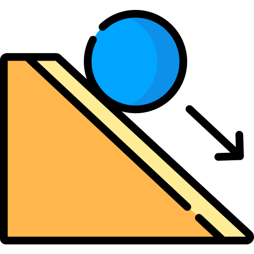
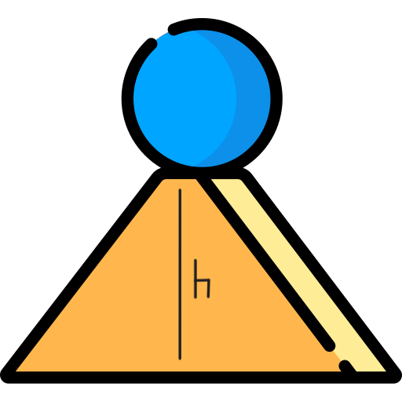

# Physics Energy Calculator

## Not logged in? - [Login Now](/DADY-Academy/security/login)

    <h1 class="maintitle" id="mainTitle">No Currently Selected Object</h1>
    <h3 class="maintitle" id="mainMass"></h3>
    <h3 class="maintitle" id="mainRecKE"></h3>
    <h3 class="maintitle" id="mainRecPE"></h3>
    

    <h3 class="maintitle"> Calculate KE </h3>
    

        <input placeholder="Velocity (v) value" style="width:65%; display: inline-block;" type="text" id="velocity-input" name="Velocity">
        <button id="calcKEbutton" style="width:33%; display: inline-block;" class="objectcardbutton"> Calculate </button>
    

     
    <h3 class="maintitle"> Calculate PE </h3>
    

        <input placeholder="Gravity (g) value" style="width:32%; display: inline-block;" type="text" id="gravity-input" name="Gravity">
        <input placeholder="Height (h) value" style="width:32%; display: inline-block;" type="text" id="height-input" name="Height">
        <button id="calcPEbutton" style="width:33%; display: inline-block;" class="objectcardbutton"> Calculate </button>
    

     
    <button id="historybutton" class="objectcardbutton" onclick="toggleHistory()"> Show History </button>
    

        <table id="histable">
        </table>
        <button style="border: 1px solid red; background-color: red; display: none;" id="clearhistorybutton" class="objectcardbutton" onclick="scrubHistory()"> Clear History </button>
    

 

## Your objects

 

    <h1 class="maintitle">Create an object</h1>
    

        <input placeholder="Mass (m) value" style="width:65%; display: inline-block;" type="text" id="mass-input" name="Object Mass">
        <button id="createbutton" style="width:33%; display: inline-block;" class="objectcardbutton" onclick="createObj();"> Create  </button>
    

<!-- <form id="obj-create-form">
    <label for="name-input">Name of Object</label> 
    <input type="text" id="name-input" name="Name"> 
    <label for="mass-input">Mass of Object</label> 
    <input type="text" id="mass-input" name="Mass"> 
    <button id="obj-create-submit">Create Object</button>
</form>

 

## KE Calculator

<form id="KE-form">
    <label for="object-selector"> Select an Object </label> 
    <select id="object-selector" name="object-selector">
        <option value="{object.ID}"> {object1.name} </option>
        <option value="{object.ID}"> {object2.name} </option>
    </select> 
    <label for="v-input">Velocity Value</label> 
    <input type="text" id="v-input" name="V"> 
    <button id="KE-submit">Calculate</button>
</form> 

 

## PE Gravity Calculator

<form id="PEG-form">
    
    <label for="object-selector"> Select an Object </label> 
    <select id="object-selector" name="object-selector">
        <option value="{object.ID}"> {object1.name} </option>
        <option value="{object.ID}"> {object2.name} </option>
    </select> 
    <label for="h-input"> Height Value</label> 
    <input type="text" id="h-input" name="H"> 
    <label for="g-input"> G Value</label> 
    <input type="text" id="g-input" name="G"> 
    <button id="PEG-submit">Calculate</button>
</form> 
-->