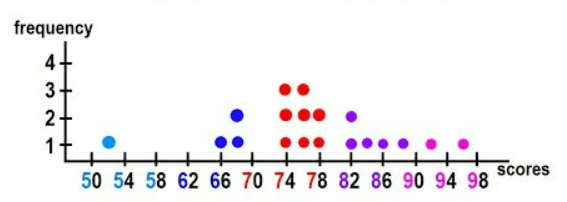

## Stats Data Modeler

### 1-Prop
<form id="data-form">
    <!-- Data Points input -->
    <label for="data-input">Input your data values, separated by commas or spaces</label> 
    <input type="text" id="data-input" name="data-input"> 
    <button type="button" id="data-submit">Model</button>
</form> 

 
Output: (currently a placeholder image for proof-of-concept, backend with image plotter will be made in the future)

<table>
    <tr>
        <th> n </th>
        <th> Mean </th>
        <th> Median </th>
        <th> Mode </th>
        <th> Range </th>
        <th> Standard Deviation </th>
    </tr>
    <tr>
        <td id="n-value"> 0 </td>
        <td id="mean"> 0 </td>
        <td id="median"> 0 </td>
        <td id="mode"> 0 </td>
        <td id="range"> 0 </td>
        <td id="sd-value"> 0 </td>
    </tr>
</table>

